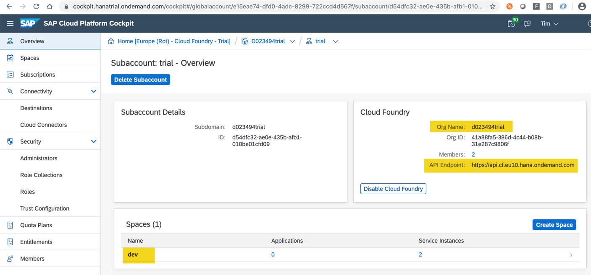
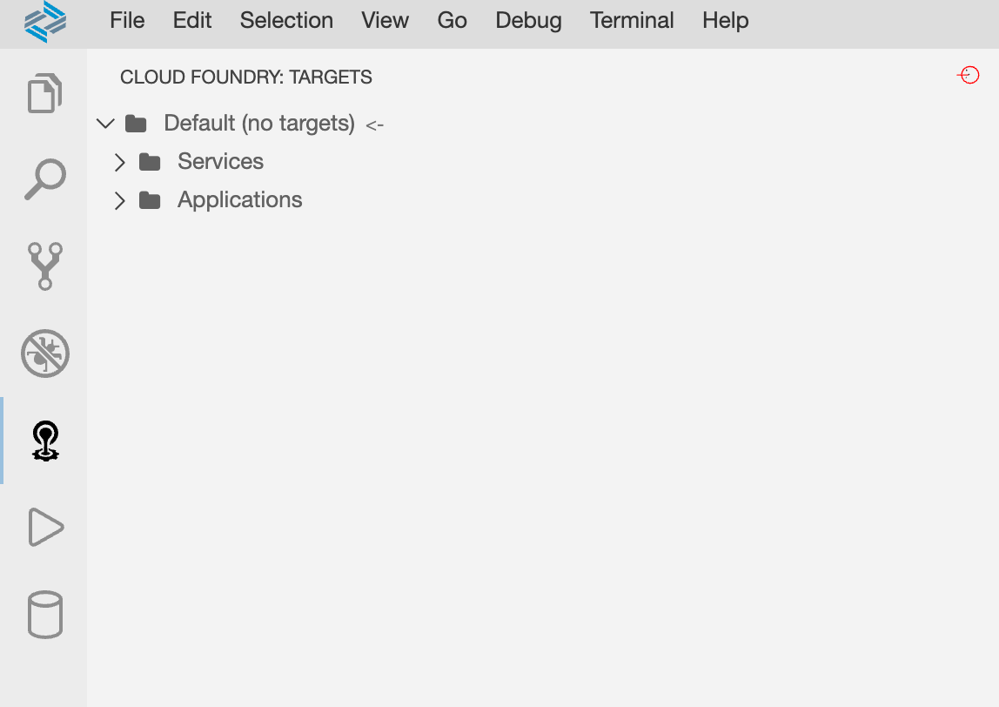
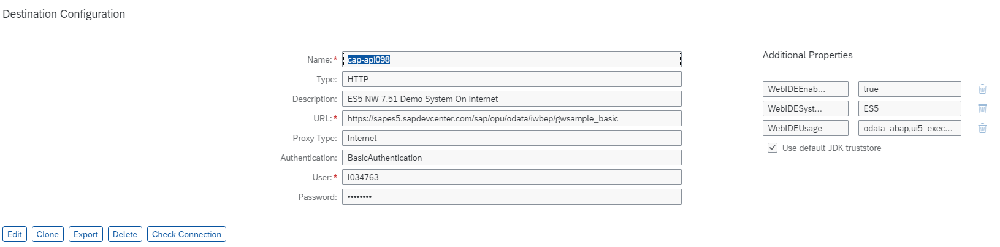
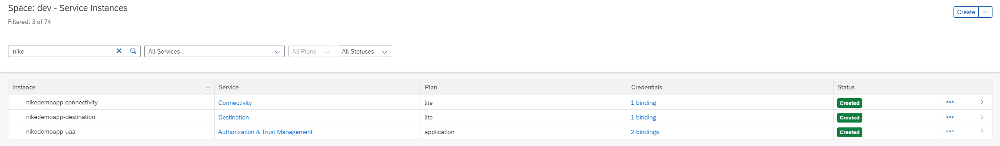
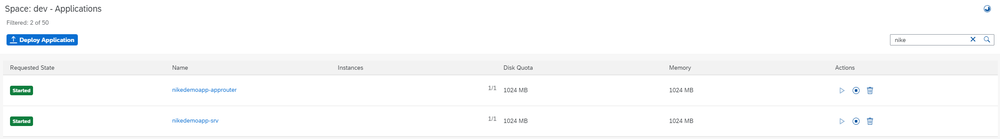
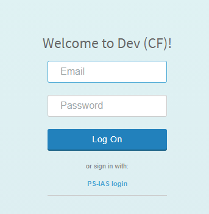
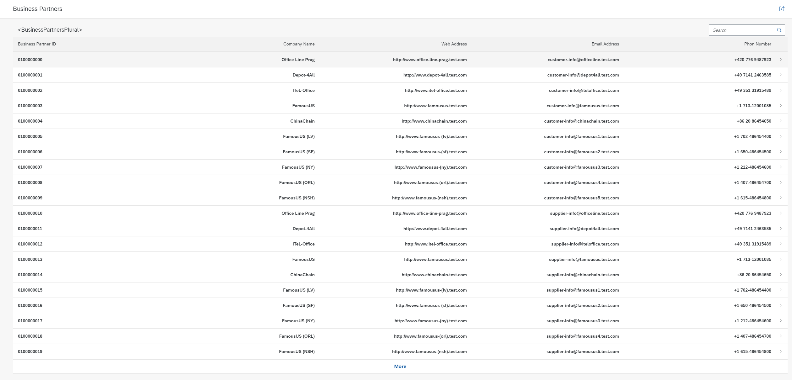

# Preparing the Environment
## Required Service Entitlements for Deployment

You've to select a number of services that you need to subscribe to, for example, Cloud Foundry Runtime. For each service, there are so-called `entitlements`, which are basically the service plans and the number of units that you want from each service, when you create an account you need to provide these also.

The following services with their service plans and entitlements are required for the different modules of the tutorial and will be needed to create the global account and subaccount.

| Service | Plan | Amount | Unit |
|--|--|--|--|
| Application Runtime | MEMORY | 4 | GB |

**The services mentioned below are Utility Services, no entitlement needed**

| Service | Plan | Amount | Unit |
|--|--|--|--|
| Connectivity | lite | 1 * | instances |
| Destination | lite | 1 * | instances |
| Authorization & Trust Management | application | 1 * | instances |

**The following mentioned applications are available as Subscriptions, no entitlement needed**

| Application | Plan | Amount | Unit |
|--|--|--|--|
|  SAP Business Application Studio | standard | 1 | ? |

## Log on to Cloud Foundry from the Command Line

In preparation of other steps log in to Cloud Foundry and target your space in the account.

If you don't know whether you’re logged on to Cloud Foundry or to which Cloud Foundry Org and Space you’re logged on you can always use ```cf target``` in a terminal to find out.

If you aren't logged on already, go to your Cloud Platform Cockpit, depending on the landscape you want to deploy to e.g "AWS Live EU 10" [https://account.hana.ondemand.com/](https://account.hana.ondemand.com/)

1. Select your ```Global Account``` and then the ```Subaccount``` to which you want to deploy you service and application.

2. On the subaccount page, gather all the data to log in to Cloud Foundry (CF):
        - the ```API Endpoint```
        - the ```Org Name```
        - the ```Space Name```

    

3. Open up a terminal or a command line.

4. Set the Cloud Foundry API endpoint.
    ```bash
    cf api <API Endpoint of your landscape>
    ```
5. Login to your Cloud Foundry account, using your Cloud Platform credentials.
    ```bash        
    cf login
    ```
## Log on to Cloud Foundry in SAP Business Application Studio

1. Choose the icon for *Cloud Foundry: Targets* on the left navigation bar to select the *Cloud Foundry: Targets* panel.
2. Choose *Create new target Cloud Foundry* on the *Cloud Foundry: Targets* panel.

    

3. Enter a name for the target, for example `cpapp`, in the popup and confirm with the *Enter* key.
4. Choose *cpapp > Services > Login Required* on the *Cloud Foundry: Targets* panel.
5. Enter the *Cloud Foundry* endpoint in the popup and confirm with the *Enter* key.

    For your convenience, the API Endpoints for the "AWS Live EU 10" Landscape is:
        [https://api.cf.eu10.hana.ondemand.com ](https://api.cf.eu10.hana.ondemand.com )

6. Enter your SAP BTP registered email address and confirm with *Enter*.
7. Enter your password and confirm with *Enter*.
8. Select the Cloud Foundry organization and confirm with *Enter*.
9. Select the Cloud Foundry space and confirm with *Enter*.

#  Prepare User Authentication and Authorization (XSUAA) Setup
To setup proper Authorization and Access Control, you will need to define the roles in your CAP application. You can find more information around how this can be done via CAP CDS [here](https://cap.cloud.sap/docs/guides/authorization).

In this application to keep things simple we have not defined any roles but we will still need to use the UAA service and bind it to our application because we want to communicate with an external service (ES5- GWSAMPLE_BASIC) for which we require the `destination` service from Cloud Foundry. To use the destination service you need to have a binding with `UAA` service. You can find more information about `SAP Authorization and Trust Management Service in the Cloud Foundry Environment` [here](https://help.sap.com/viewer/65de2977205c403bbc107264b8eccf4b/Cloud/en-US/6373bb7a96114d619bfdfdc6f505d1b9.html)

## Enable Authentication Support

To enable authentication support in CAP for SAP BTP, the `xssec`, and `xsenv` modules need to be installed. These are client side libraries that allows our applications's approuter to act as a OAuth 2.0 Client.

In your project's root folder execute:
```bash
npm i --save  @sap/xssec  @sap/xsenv
```

This will enhance your `package.json` and you will see new dependencies added to it as follows:

```
"dependencies": {
    "@sap/cds": "^4",
    "@sap/xsenv": "^3.1.0",
    "@sap/xssec": "^3.1.2",
    "express": "^4"
  },
```

## Add UAA Service

We need to tell CAP that XSUAA is used. For this open the `package.json` folder in your `cpapp` project and add the following lines:

<!-- cpes-file package.json:$.cds.requires -->
```json hl_lines="9-12"
    "cds": {
        "requires": {
            "GWSAMPLE": {
                "kind": "odata",
                "model": "srv/external/GWSAMPLE",
                "credentials": {
                    "destination": "cap-api098"
                }
            }
        },
        "uaa": {
            "kind": "xsuaa",
            "credentials": {}
        }
    }
```

## Add XSUAA Security Configuration
Create the file xs-security.json by executing:
```
cds compile srv --to xsuaa >xs-security.json
```

This would generate a new file named `xs-security.json` in the project's root folder with following content:
```
{
  "xsappname": "nikedemoapp",
  "tenant-mode": "dedicated",
  "scopes": [],
  "attributes": [],
  "role-templates": []
}
```
Since we have not defined and authorization parts in our application we find that no scopes, attributes or role-templates exist in this file. For a minimal integration with CF XSUAA we need the bare bones strcuture of this file which can later be enhanced to add these security artefacts.

# Prepare UI Application using the SAP Application Router
Although you can run your application with a UI locally, you're not able to use the UI on the cloud since it's not deployed yet. This is provided by another application (module in the MTA context). This application is a so-called AppRouter application that contains all our static UI files and allows access to the CAP service from the UI.

## Create the AppRouter NPM Module
1. Create a folder `approuter` where you store all AppRouter artifacts and switch to the new folder:
    ```
    mkdir approuter
    cd approuter
    ```

2. Initialize npm in this folder (creates a `package.json`) and install the latest version of AppRouter NPM module (this is a SAP's custom implementation to support OAuth 2.0 protocol, in this case as the Oauth 2.0 Client):
    ```
    npm init --yes
    npm install @sap/approuter
    ```    
3. Check the required Node.js version supported by our AppRouter. This is declared in the package.json file of the AppRouter and can be checked by the following command:
    ```
    cat node_modules/@sap/approuter/package.json | grep '"node"'
    ```
    You will see an output as follows:
    ```
    "node": "^12.0.0 || ^14.0.0"
    ```

4. Using the above information, add required Node.js version in approuter/package.json file as follows:
    ```
    {
        "name": "approuter",
        ...
        ...
        "dependencies": {
            "@sap/approuter": "^10.0.0"
        },
        "engines": {
            "node": "^12.0.0"
        }
    }
    ```
5. Add the start script for the AppRouter in approuter/package.json file. This will make the final file look as follows:
    ```
    {
        "name": "approuter",
        "version": "1.0.0",
        "description": "",
        "main": "index.js",
        "scripts": {
            "test": "echo \"Error: no test specified\" && exit 1",
            "start": "node node_modules/@sap/approuter/approuter.js"
        },
        "keywords": [],
        "author": "",
        "license": "ISC",
        "dependencies": {
            "@sap/approuter": "^10.0.0"
        },
        "engines": {
            "node": "^12.0.0"
        }
    }
    ```

## Add AppRouter Configuration
Configure the AppRouter by creating a file approuter/xs-app.json with the following content:
```
{
    "welcomeFile": "/app/businesspartners/webapp/index.html",
    "authenticationMethod": "route",
    "sessionTimeout": 30,
    "logout": {
        "logoutEndpoint": "/do/logout",
        "logoutPage": "/"
    },
    "routes": [
        {
            "source": "^/app/(.*)$",
            "target": "$1",
            "localDir": "resources",
            "authenticationType": "xsuaa"
        },
        {
            "source": "^/service/(.*)$",
            "destination": "srv-api",
            "authenticationType": "xsuaa"
        }
     ]
}
```
You've to tell the AppRouter how to respond to requests via the routes configurations in this file:
1. The files in the `resources` folder will be served for all requests to `/app`. Later, there’s an explanation how you get the "app" files into this resource folder.
2. All requests starting with `/service` will be forwarded to the CAP service based on the URL we configured in the MTA using the `destination: srv-api`. Remember, the `BusinessPartners` service is reachable via `/service/browse/BusinessPartners`. 
3. Future services added in future will automatically be routed as long as they start with `/service/` as well.
4. AppRouter will automatically redirect to the `/app/businesspartners/webapp/index.html` when accessed without a path, which will then serve the file `resources/businesspartners/webapp/index.html`.

## Add script to build SAPUI5 Files
Add the script app/build.sh to execute the SAPUI5 build:

```
#!/bin/bash
set -e
cd "$(dirname "$0")"
rm -rf dist
mkdir dist
#cp launchpage.html dist
for APP in *; do
    if [ -f "$APP/webapp/manifest.json" ]; then
        echo "Build $APP"
        cd "$APP"
        if [ ! -f "package.json" ]; then
            npm init --yes
        fi
        npm install
        npm install --save-dev @ui5/cli
        if [ ! -f "ui5.yaml" ]; then
            cat >ui5.yaml <<EOF
specVersion: "2.1"
type: application
metadata:
  name: $APP
EOF
        fi
        npx ui5 build --dest "../dist/$APP/webapp"
        cd ..
    fi
done
```
- Each SAPUI5 application needs the module `@ui5/cli` for the build and a `ui5.yaml` file. The script creates the file if it doesn't exist. It can be modified if needed.
- The SAPUI5 build is then triggered and writes the results into the folder `app/dist/<app-folder-name>/webapp`
- The `webapp` folder is part of the design time structure of SAPUI5 and usually doesn't show up at runtime. However, the build script keeps this folder, so that the URLs in the `launchpage.html` work for the AppRouter and keep working locally too.

# Configuring the Application as MTA using `mta.yaml`

Its possible to individually deploy the modules of our application individually using the respective CLI tools relevant for each module. But that approach takes more work and can lead to errors. 

A more robust approach is to design your application as a multi-target application (MTA) that comprises of multiple pieces of software called “modules” which all share a common lifecycle for development and deployment. To do this we can define a `Development Descriptor: mta.yaml` file in our project where as a developer we can declare all our applications modules, their dependencies, the resources they provide and consume. The `MTA Build tool: mbt` is able to understand this development descriptor and generates a `Multi Target Application Archive: MTAR`  that can then be deployed as a single application bundle to Cloud Foundry using `cf deploy`.

The key advantages compared to the independent module deployments are:
1. a build tool, 
2. automatically created service instances, service keys, destinations, content deployment (HTML5, workflow, ...), and 
3. blue-green deployment.

## Generate MTA Deployment Descriptor (mta.yaml)
As the first step, you let CAP generate an initial mta.yaml file. Run the following command from the project root folder:
```
cds add mta
```
The cds CLI will generate the file based on the current settings in the package.json file. As we only have a Service Module known to the CDS at this point in time we only see `nikedemoapp-srv` module in the mta.yaml as shown:

```
## Generated mta.yaml based on template version 0.4.0
## appName = nikedemoapp
## language=nodejs; multiTenant=false
## approuter=
_schema-version: '3.1'
ID: nikedemoapp
version: 1.0.0
description: "A simple CAP project."
parameters:
  enable-parallel-deployments: true
   
build-parameters:
  before-all:
   - builder: custom
     commands:
      - npm install --production
      - npx -p @sap/cds-dk cds build --production

modules:
 # --------------------- SERVER MODULE ------------------------
 - name: nikedemoapp-srv
 # ------------------------------------------------------------
   type: nodejs
   path: gen/srv
   provides:
    - name: srv-api      # required by consumers of CAP services (e.g. approuter)
      properties:
        srv-url: ${default-url}
```

As a next step, we will add more elements to this descriptor to ensure all our modules along with needed dependencies can be deployed together.

## Add Authorization and Trust Management Service (XSUAA) to `mta.yaml`
The next step is to add the Authorization and Trust Management service to mta.yaml to allow user login, authorization, and authentication checks.

```
modules:
::
::
resources:
# services extracted from CAP configuration
# ------------------------------------------------------------
 - name: nikedemoapp-uaa
# ------------------------------------------------------------ 
   type: org.cloudfoundry.managed-service
   parameters:
    service: xsuaa
    service-plan: application
    path: ./xs-security.json
    config:
      xsappname: 'nikedemoapp-uaa'
```
- The configuration for XSUAA is read from the xs-security.json file that was created a step before.

## Add SAPUI5 Builder Module to `mta.yaml`
The resources for the AppRouter origin come from the app folder. Add another module cpapp-app in mta.yaml to build these resources for use in the AppRouter:

```
 # -------------------- APP BUILDER MODULE ------------------------
 - name: nikedemoapp-app
 # ------------------------------------------------------------
   type: html5
   path: app
   build-parameters:
     builder: custom
     commands:
      - bash build.sh
     supported-platforms: []
     build-result: dist
```
- This will call the script `build.sh` in the `app` folder and expects the build result in `app/dist`. 
- By providing an empty list of `supported-platforms`, it’s ensured that this "module" isn't deployed to the cloud and is only needed to build the SAPUI5 apps.

## Add AppRouter Module to `mta.yaml`
```
# -------------------- APP-ROUTER DEPLOYER MODULE ------------
 - name: nikedemoapp-approuter
# ------------------------------------------------------------ 
   type: nodejs
   path: approuter
   requires:
     - name: nikedemoapp-uaa
     - name: srv-api
       group: destinations
       properties:
          forwardAuthToken: true
          strictSSL: true
          name: srv-api
          url: '~{srv-url}'
   build-parameters:
     requires:
       - name: nikedemoapp-app
         artifacts:
           - ./*
         target-path: resources
```
- The AppRouter takes the SAPUI5 build results from the `nikedemoapp-app` and puts it in the `resources` directory. This is where the `xs-app.json` looks for the files requested for `/app/....`
- The `nikedemoapp-uaa` binding adds our already existing the `XSUAA` service instance to the AppRouter, which makes login and logout possible. By this the AppRouter forwards requests with the authentication token `(Authorization: Bearer <jwt-token>)` to the CAP service. The CAP service then uses it for authentication and authorization checks.
- The `srv-api` creates an environment variable `destinations` that contains a JSON array with one object containing the "destination" to the CAP service. This is required to forward requests to the CAP service. The generated environment variable looks like this:
    ```
    destinations='[{ "name": "srv-api", "forwardAuthToken": true, "strictSSL": true, url: "https://..." }]
    ```
- The URL is taken from the `cpapp-srv` module that needs to be enhanced to export this information.

## Add Destination and Connectivity Service to `mta.yaml`

To access the external service, it's required to add Destination service instance and connectivity to the resources section of mta.yaml file:

**Destination**
```
resources:
::
::
# ------------------------------------------------------------
 - name: nikedemoapp-destination
# ------------------------------------------------------------ 
   type: org.cloudfoundry.managed-service
   parameters:
      service: destination
      service-plan: lite
```
**Connectivity**
```
resources:
::
::
# ------------------------------------------------------------
 - name: nikedemoapp-connectivity
# ------------------------------------------------------------ 
   type: org.cloudfoundry.managed-service
   parameters:
     service: connectivity
     service-plan: lite
```
*Note:* We require `connectivity` service only while making a connection to On-Premise systems using SAP Cloud Connector. In this demo since we are making a connection to a service available on Internet the `connectivity` service is not needed and `destination` is sufficient for this to work.

### Adapt CAP Server Module to use UAA, Destination and Connectivity
Do the following changes for the nikedemoapp-srv module to the mta.yaml:

```
modules:
 # --------------------- SERVER MODULE ------------------------
 - name: nikedemoapp-srv
 # ------------------------------------------------------------
   type: nodejs
   path: gen/srv
   requires:
      - name: nikedemoapp-uaa
      - name: nikedemoapp-destination
      - name: nikedemoapp-connectivity
   provides:
    - name: srv-api      # required by consumers of CAP services (e.g. approuter)
      properties:
        srv-url: ${default-url}
```

# Creating a Destination on Cloud Foundry
Before we upload the application to Cloud Foundry we need to create a destination named `cap-api098` in our sub-account as this is needed by our service to connect to the external service. While testing locally we could leverage the `default-env.json` to provide this information but after deployment to CF we need to have an actual destination as shown below for the application to work:



# Build and Deploy, and Test mtar File
1. Build the MTA module from the project root folder:
    ```
    mbt build -t ./
    ```
    This creates a mtar file nikedemoapp_1.0.0.mtar in the current folder (option: -t ./).

2. Deploy the module to your current Cloud Foundry space:
    ```
    cf deploy nikedemoapp_1.0.0.mtar
    ```

3. After successful deployment, check if all the services have been created:
    ```
    cf services
    ```
   You can see these services running on the console as well as directly on Cockpit:
   


4. Check if the apps are running:
    ```
    cf apps
    ```
    You can see these apps running on the console as well as directly on Cockpit:
   


5. Open the AppRouter URL in the browser. It will ask you to enter your CF credentials and then directly launch the SAPUI5 application:

    

    

# Undeploy a Multi Target Application

To undeploy (delete) an MTAR, you don't need to delete the apps and the services individually. The deploy service on Cloud Foundry keeps track on the deployed mtar and its resources.

You can either undeploy the applications or undeploy the applications and its service instances, which will delete the data stored in these instances (for example, database content) as well.

- Delete applications only:
    ```
    cf undeploy nikedemoapp
    ```

- Delete applications and service instances:
    ```
    cf undeploy nikedemoapp --delete-service-keys --delete-services
    ```