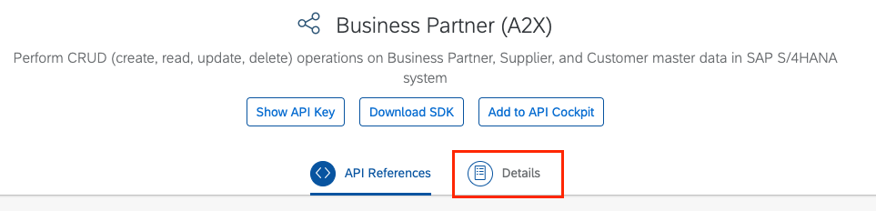
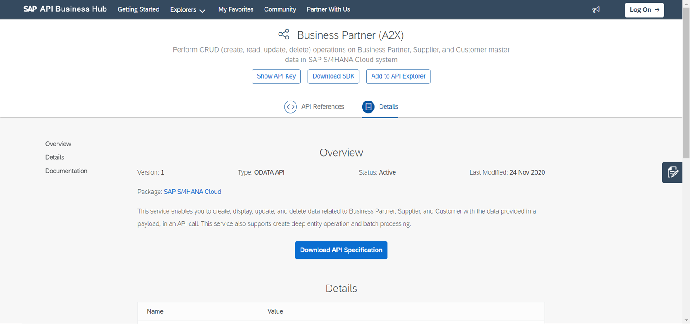
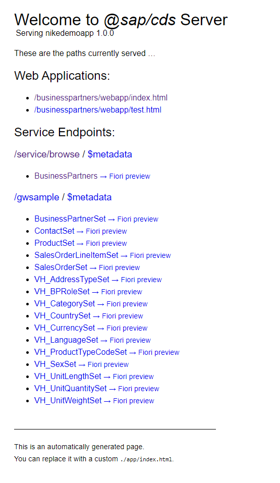

# Add the Consumption of an External Service Exposed to Your Service

In this chapter, you extend your CAP service with the consumption of an external Business Partner service. You get its definition from SAP's SAP API Business Hub. First, work with local data and later on get the data directly from the external SAP S/4HANA system.

## Get the Business Partner EDMX File

1. Open the Business Partner (A2X) API for S/4HANA Cloud on the [SAP API Business Hub](https://api.sap.com/api/API_BUSINESS_PARTNER/overview).
2. Choose the ```Details``` tab.

    

3. Choose the **Download API Specification** button.
4. Choose the ```EDMX``` option from the list (if you’re asked to log on, log on).

    If you’re using Chrome as a browser, you now see the downloaded file in the footer bar:
    

    
**Workaround in absence of SAP S/4HANA**

As we do not have a SAP S/4HANA system we will be leveraging the ES5 system that is available free for use as a SAP Gateway Demo System on the Internet. You can find the instructions on how to create an account on this sytem [here](https://developers.sap.com/tutorials/gateway-demo-signup.html)

We will use the GWSAMPLE_BASIC ODATA service available at this URL: https://sapes5.sapdevcenter.com/sap/opu/odata/iwbep/gwsample_basic/ which contains a represenation of the BusinessPartner entity that we are using in the project.

You can download the EDMX file by calling the URL: https://sapes5.sapdevcenter.com/sap/opu/odata/iwbep/gwsample_basic/$metadata and saving this file with the name GWSAMPLE.edmx 

## Add the EDMX File to the Project and Add Local Data

1. Make sure ```cds watch``` is still running.
2. Drag the ```GWSAMPLE.edmx``` file and drop it into the ```srv``` folder of your project.

    CAP has noticed the new file and automatically created a new ```external``` folder under ```srv``` and in it added a new ```GWSAMPLE.csn``` file. ([CSN](https://cap.cloud.sap/docs/cds/csn) being a compact representation of CDS)

3. In your browser, open http://localhost:4004/.

    The browser now shows a ```BusinessPartner``` service next to the existing OData service
    

    At this point, you've a new service exposed with a definition based on the original edmx file. However, it doesn't have any connectivity to a backend and thus, there’s no data yet. You will still be seeing the mock data in the original service.

4. Switch off persistence behavior of the existing BusinessPartners entity
   Open the file ```db/schema.cds``` and add the following two annotations above the Entity definition.
   ```
    namespace nike.demo;

    using {managed} from '@sap/cds/common';

    using {  GWSAMPLE as external } from '../srv/external/GWSAMPLE.csn';

    @cds.persistence.skip
    @cds.persistence.mock:false
    entity BusinessPartners as projection on external.BusinessPartnerSet {
        //key ID                  : UUID @(Core.Computed : true),
        key BusinessPartnerID   : String(10),
            CompanyName         : String(80),
            WebAddress          : String,
            EmailAddress        : String(255),
            PhoneNumber         : String(30)
    }

   ``` 
   
    In normal cases CAP would get the data from your own DB and your local data in it. Until now it had no indication that the service is actually from somewhere else. But now you've given CAP an EDMX file with a definition telling CAP that it should get the data from the ```BusinessPartnerSet``` entity of the original service that you imported. As a next step, you need to tell CAP where to get the data from and how to connect to the corresponding system. 

    We have also commented `ID` field and made BusinessPartnerID as key because now this entity is a projection on the external service and thus cannot contain any field outside the defintion of the external entity.

   `@cds.persistence.skip`: tells the compiler, this entity shall not exist in database at all

   `@cds.persistence.mock`: when `false` excludes this entity from automatic mocking
 

5. In your browser, open the ```BusinessPartners``` link to see the data and you will receive an error.
    ```
    <error xmlns="http://docs.oasis-open.org/odata/ns/metadata">
    <code>501</code>
    <message>Entity "BusinessPartnerService.BusinessPartners" is annotated with "@sap.persistence.skip" and cannot be served generically.</message>
    <annotation term="Common.numericSeverity" type="Edm.Decimal">4</annotation>
    </error>
    ```
    This indicates that the ```BusinessPartners``` entity is not persistent meaning won't have any associated DB table and therefore the CDS runtime cannot automatically fetch the data for this. It means now the responsibility of providing the data for this service lies on your implementation.

    In the next step, you change the code, so the data is fetched from the actual service in an SAP S/4HANA system *(in our case ES5 Gateway system)*.

6. Create a new file ```srv/nike-service.js``` and add the following code into it.

    ```
    /**
    * Service Implementation for nike-service.cds
    */
    module.exports = async (srv) => {
        const BupaService = await cds.connect.to('GWSAMPLE');
    
        srv.on('READ', 'BusinessPartners' , async (req) => {
            return await BupaService.tx(req).run(req.query);
        });
    }
    ```
    You've now created a custom handler of your service. This time it's called ```on``` the ```READ``` event of your ```BusinessPartners``` service, so whenever there’s a request for business partner data, this handler is called.

As a next step, you need to tell CAP where to get the data from and how to connect to the corresponding system. You need a file that defines the connection to the system.


## Locally Connect to a System

If you have access to a S/4HANA system and a user with permission for the *Business Partner* OData API then you can try it out with the local CAP application.

1. Create a file `default-env.json` in the `root` folder:

    ```json
    {
        "VCAP_SERVICES": {
        "s4-hana-cloud": [
            {
            "name": "cap-api098",          
            "credentials": {
                "Type": "HTTP",
                "XFSystemName": "ES5",
                "User": "I034763",
                "Authentication": "BasicAuthentication",
                "WebIDEEnabled": "true",
                "ProxyType": "Internet",
                "URL": "https://sapes5.sapdevcenter.com/sap/opu/odata/iwbep/gwsample_basic",
                "Name": "ES5",
                "Password": "np13ip13"
            },
            "syslog_drain_url": null,
            "volume_mounts": []
            }
        ]
        }
    }
    ```

    This file is unlike the other files you've used in the tutorial. As opposed to the others it's not something that a developer would create with a simple text editor. It's used to provide [environment variables for Cloud Foundry](https://docs.cloudfoundry.org/devguide/deploy-apps/environment-variable.html) that are injected into an application on Cloud Foundry. Here, it is used to simulate a destination to a S/4HANA system.

2. Replace the placeholders in the file:

    * `<url>` - Host with domain of the SAP S/4HANA system (e.g. `system.company.com`)
    * `<user>` - User name
    * `<password>` - Password for the user

    In the following step, you need to tell CAP that it should use the destination ```cap-api098```, when accessing the business partner service.

3. Open the ```package.json``` file in the ```root``` folder.

4. Locate the ```cds/requires/GWSAMPLE``` object and replace it with the following code.

    ```JSON hl_lines="5-8"
    "cds": {
        "requires": {
        "GWSAMPLE": {
            "kind": "odata",
            "model": "srv/external/GWSAMPLE",
            "credentials": {
            "destination": "cap-api098"
            }
        }
        }
    }
    ```

    With this code, you add the ```credentials```part with the destination.

5. Navigate to http://localhost:4004/service/browse/BusinessPartners

    You now see much more data that is retrieved directly from the Gateway system.
