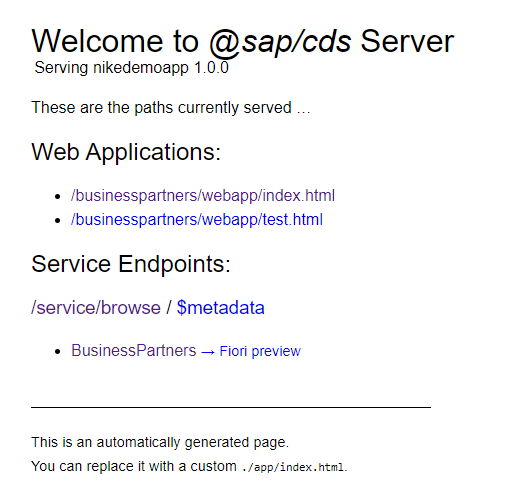

# Create a Freestyle UI5 Application

In this chapter, you build a SAPUI5 Freestyle application using the `BusinessPartners` entity of our CAP-based service.

## Creating the Application

- Create a Freestyle UI application by pressing CTRL+SHIFT+P to open command pallette window in BAS as shown below:


- Select SAPUI5 Freestyle Template and Pick "SAP Fiori Worklist Application"


- Use "Local CAP Project" and point to the root of your project folder. It will automatically find the BusinessPartnerService as the OData service to target


- Input the values as shown below


- Input the values as shown below


This will generate a project under the ```app``` folder with name ```businesspartners``` as shown:


- Open the newly created file `manifest.json` in your `/app/businesspartners/webapp` folder.

- Add a ```/``` to the beginning of the value of the ```uri``` parameter [!!!In case its not present]

	```javascript hl_lines="7"
        "dataSources": {
                    "mainService": {
                        "uri": "/service/browse/",
                        "type": "OData",
                        "settings": {
                            "odataVersion": "4.0",
                            "localUri": "localService/metadata.xml"
                        }
                    }
                }
	```

    **"Why is there a mapping needed?"**
	Freestyle SAPUI5 templates don’t have the special treatment of CAP yet and instead make no assumption where the OData service comes from, it could be a remote one based on another framework. To make the connection, the above mapping is needed. SAPUI5 has a so-called middleware that proxies to the remote service. You can see this by opening the `ui5.yaml` file under `/app/businesspartners`:

	```yaml
	...
	server:
		customMiddleware:
		- name: ui5-middleware-simpleproxy
			mountPath: /businesspartners
			afterMiddleware: compression
			configuration:
			baseUri: http://localhost:4004/service/risk
	```

The change in the `manifest.yaml` is to make sure that the data requests are used with an absolute URL at `/businesspartners`. The original entry for the URI was `businesspartners`. This would have triggered SAPUI5 to issue any data request relative to the path of the application itself, but we want the requests to be absolute.

## Starting the Application

1. Make sure `cds watch` is still running in the project root folder:

	```
	cds watch
	```

2. Open the URL http://localhost:4004/.

	You snow see two new HTML pages.

	

3. Choose the `/businesspartners/webapp/index.html` entry.

	

	As a result, you can see a list but you can only see the IDs of the Business Partners both in the list view and on the detail page. This is because the freestyle template only got the information from you that the `Object Collection ID` is the `ID` property of the `businesspartners` service. You can now add additional SAPUI5 controls that are bound to additional properties of the service.

4. Open the view of the work list `/app/businesspartners/webapp/view/Worklist.view.xml`  and add the following code:

	```XML hl_lines="2-10 19-23"
		<columns>
            <Column id="nameColumn">
                <Text text="Business Partner ID" id="nameColumnTitle"/>
            </Column>
            <Column id="CompanyNameColumn" hAlign="End">
                <Text text="Company Name" id="CompanyNameColumnTitle"/>
            </Column>
            <Column id="WebAddressColumn" hAlign="End">
                <Text text="Web Address" id="WebAddressColumnTitle"/>
            </Column>
            <Column id="EmailAddressColumn" hAlign="End">
                <Text text="Email Address" id="EmailAddressColumnTitle"/>
            </Column>
            <Column id="PhoneNumberColumn" hAlign="End">
                <Text text="Phon Number" id="PhoneNumberColumnTitle"/>
            </Column>
        </columns>

        <items>
            <ColumnListItem
                type="Navigation"
                press=".onPress">
                <cells>
                    <ObjectIdentifier
                        title="{BusinessPartnerID}"/>
                    <ObjectIdentifier
                        title="{CompanyName}"/>
                    <ObjectIdentifier
                        title="{WebAddress}"/> 
                    <ObjectIdentifier
                        title="{EmailAddress}"/> 
                    <ObjectIdentifier
                        title="{PhoneNumber}"/>                                                   
                </cells>
            </ColumnListItem>
        </items>
	```
5. Refresh the `businesspartners` application in your browser.

	You can now see the new content in the work list. *The details in the object page have not been enhanced*

	

Now you have a UI that can consume your local OData V4 service that has been exposed using the CAP model.