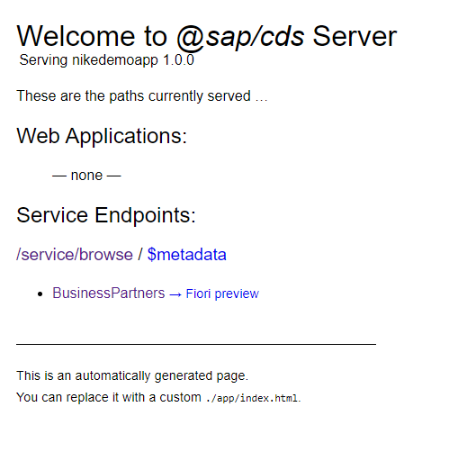
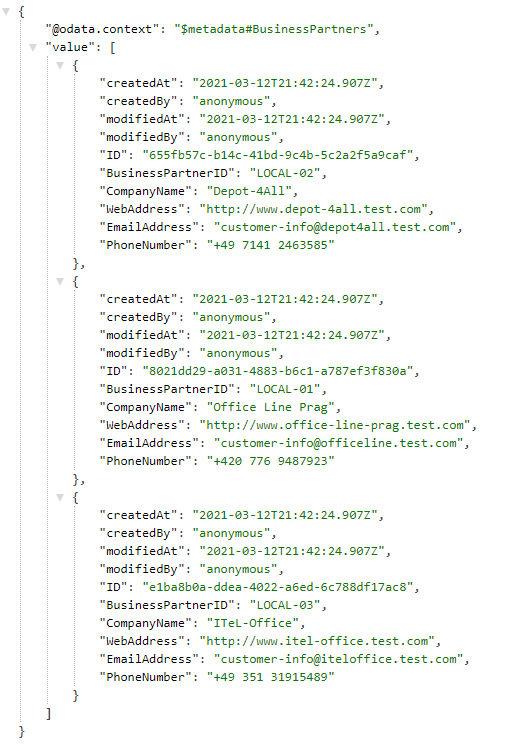

# Create a CAP-Based Service

In this part, you create a new CAP-based service, which exposes the OData V4 protocol. To do so, you use CAP's tooling `cds init` and `cds watch` in a command-line interface.

## Create and Initialize the Project

1. Open a terminal.
2. Create a directory ```<myDirectory>``` on your computer, where you want to develop the app.
3. Navigate to that directory.
  ```
  cd <myDirectory>
  ```
4. Create an initial CAP project by executing the command `cds init`. It creates the project in a new folder called ```cpapp```.
  ```
  cds init cpapp
  ```
5.  Enter the project folder.
  ```
  cd cpapp
  ```

6. Open a Terminal window

8. In the terminal, start a CAP server.
    ```
    cds watch
    ```
  
    The CAP server serves all the CAP sources from your project. It also "watches" all the files in your projects and conveniently restarts whenever you save a file. Changes you've made will immediately be served without you having to do anything.

    The CAP server tells you that there’s no model yet that it can serve. You add one in the next steps which are now shown in individual feature branches.

## Add Files to the Project

1. Create the file named `schema.cds` in the `db` folder of your app.

    This is the code:

    ```javascript
    namespace nike.demo;

    using {managed} from '@sap/cds/common';

    entity BusinessPartners : managed {
        key ID                  : UUID @(Core.Computed : true);
            BusinessPartnerID   : String(10);
            CompanyName         : String(80);
            WebAddress          : String;
            EmailAddress        : String(255);
            PhoneNumber         : String(30);
    }
    ```

    It creates an entity in the namespace ```nike.demo```: ```BusinessPartners```. It has a key called ```ID``` and several other properties. They key is automatically filled by the CAP server, which is exposed to the user of the service with the annotation `@(Core.Computed : true)`.
    
    Notice how the CAP server reacted to dropping the file. It now tells you that it has a model but there are no service definitions yet and, thus, it still can’t serve anything. So, you add a service definition.

2. Create a file `nike-service.cds` in the `srv` folder of your app.

    The content of the file looks like this:

    ```javascript
    using {nike.demo as my} from '../db/schema';

    @path : 'service/browse'
    service BusinessPartnerService {
        entity BusinessPartners as projection on my.BusinessPartners;
    }


    ```

    It creates a new service ```BusinessPartnerService``` in the namespace ```nike.demo```. This service exposes the entity ```BusinessPartners``` which is exposing the entities of the database schema you’ve created in the step before.

    If you again look at the terminal, you see that the CAP server has noticed the new file and now tells us that it serves something under http://localhost:4004.

3. Open a browser with http://localhost:4004 and you see:

    

4. Choose the ```$metadata``` link.

    You see the OData metadata document of your new service. So, with just the 2 files for the database schema and the service exposure you’ve added to your project, you have a running OData service!
    
    If you now choose the ```BusinessPartners``` link, you only get this:

    ```javascript
    {
        "@odata.context": "$metadata#BusinessPartners",
        "value": []
    }
    ```

    So, there’s no data yet. This is of course because so far your model doesn’t contain any data. You add some now.

5. Create a folder `data` under the `db` folder of your app. Add a csv file named ```nike.demo-BusinessPartners.csv``` with the following contents in it

    ```csv
        BusinessPartnerID,CompanyName,WebAddress,EmailAddress,PhoneNumber
        LOCAL-01,Office Line Prag,http://www.office-line-prag.test.com,customer-info@officeline.test.com,+420 776 9487923
        LOCAL-02,Depot-4All,http://www.depot-4all.test.com,customer-info@depot4all.test.com,+49 7141 2463585
        LOCAL-03,ITeL-Office,http://www.itel-office.test.com,customer-info@iteloffice.test.com,+49 351 31915489

    ```
    The first line contains all the properties from your ```BusinessPartners``` entity. While the other ones are straight forward. We have delibrately named the ID as LOCAL-XX so that when later we pull the data from an external service we can figure the difference out easily

    As always, the CAP server has noticed the change.

8. Revisit the ```BusinessPartners``` entity http://localhost:4004/service/browse/BusinessPartners in your browser, you now see the data exposed:

    

And that's it: You’ve now got a full blown OData service, which complies to the OData standard and supports the respective queries without having to code anything but the data model and exposing the service itself.

!!! info "The service is completely exposed without any authentication or authorization check. You extend the service later with such checks."